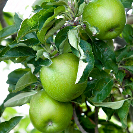
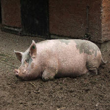

# Results
## Apple

|Name|Class|Score|
|---|---|---|
|AlexNet|pomegranate|89.4%|
|DenseNet-121|pineapple|97.5%|
|EfficientNet-b0|strawberry|90.2%|
|Mobilenet-v3|orange|94.1%|
|ResNet-50|jackfruit|91.6%|
|SqueezeNet-v1.1|lemon|98.2%|
|VGG-11|banana|96.1%|

## Ball

|Name|Class|Score|
|---|---|---|
|AlexNet|croquet ball|90.3%|
|DenseNet-121|ping-pong ball|98.4%|
|EfficientNet-b0|baseball|98.6%|
|Mobilenet-v3|basketball|98.9%|
|ResNet-50|tennis ball|97.6%|
|SqueezeNet-v1.1|golf ball|98.9%|
|VGG-11|volleyball|98.1%|

## Pig

|Name|Class|Score|
|--|--|--|
|AlexNet|brown bear|89.5%|
|DenseNet-121|cougar|98.6%|
|EfficientNet-b0|zebra|96.4%|
|Mobilenet-v3|tiger|97.7%|
|ResNet-50|triceratops|94.4%|
|SqueezeNet-v1.1|hippopotamus|98.9%|
|VGG-11|Komodo dragon|99.0%|

# Usage
## Setup
```
pip install -r requirements.txt
```
## Run
```
python main.py IMAGE
```
**WARNING: this will download large image models onto your local machine**
### Help
```
usage: main.py [-h] IMAGE

positional arguments:
  IMAGE       image to classify

options:
  -h, --help  show this help message and exit
```